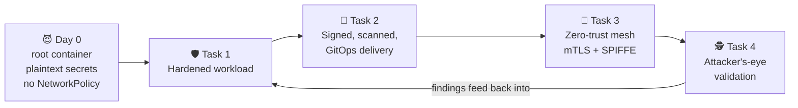
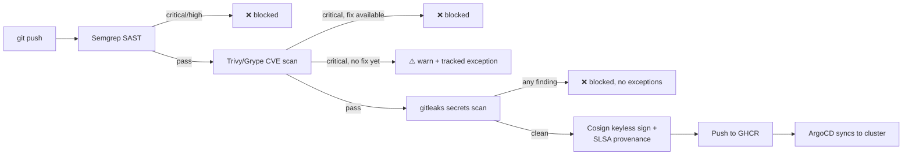
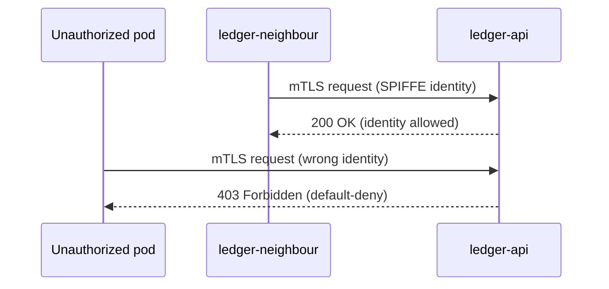

<div align="center">

# 🔒 Dodo Payments — Ledger Hardening
### Security & DevOps Engineer · Technical Assessment

*A microservice handling cardholder-adjacent data walked onto a shared cluster wearing root privileges and a plaintext key. The audit clock is running. This is the fix.*


</div>

---

## 🗺️ The brief, in one breath

`ledger-api` was shipped fast and insecure: plaintext secrets, a root
container, zero network policy, sitting inside PCI DSS scope. This repo is
the end-to-end response — harden the workload, rebuild the delivery
pipeline so security is enforced by the pipeline and not good intentions,
wrap the service in identity-based zero-trust, then switch hats and try to
break in.

No cloud account. No shortcuts on evidence — every control below is proven,
not asserted.



---

## 🧭 Navigate the repo

| # | Task | What it proves | Go there |
|---|------|-----------------|----------|
| 1 | **Workload Hardening** | The pod can't be trivially popped, and if it is, it can't do anything | [`task-1-workload-hardening/`](./task-1-workload-hardening) |
| 2 | **Secure CI/CD & Supply Chain** | Nothing unscanned, unsigned, or leaking secrets reaches the cluster | [`task-2-secure-cicd/`](./task-2-secure-cicd) · [`.github/workflows/`](./.github/workflows) |
| 3 | **Zero-Trust Mesh (Istio)** | Services trust identity, not IP — and defense-in-depth is real, not decorative | [`task-3-istio-zero-trust/`](./task-3-istio-zero-trust) |
| 4a | **Recon (passive)** | What an outside attacker sees before they touch anything | [`task-4-recon-pentest/part-a-recon/`](./task-4-recon-pentest/part-a-recon) |
| 4b | **Pen Test (authorized)** | The hardening actually holds under pressure | `task-4-recon-pentest/part-b-pentest/` *(in progress)* |
| — | **Runbook** | Every command + expected output, so this is reproducible, not a screenshot slideshow | [`LOCAL-SETUP-AND-RUNBOOK.md`](./LOCAL-SETUP-AND-RUNBOOK.md) |

---

## ⚡ Quickstart

```powershell
# 1. Start Docker Desktop manually, then:
Set-ExecutionPolicy -Scope Process Bypass -Force
.\scripts\install-windows-tools.ps1

# 2. Stand up kind + Ingress + Sealed Secrets + Kyverno + ArgoCD + Istio in one shot
.\scripts\create-local-kind-platform.ps1

# 3. Sanity check
kubectl get nodes
kubectl get pods -A
```

Full command-by-command verification for every task lives in
[`LOCAL-SETUP-AND-RUNBOOK.md`](./LOCAL-SETUP-AND-RUNBOOK.md) — nothing here
is "trust me," everything has a command attached.

---

## 🛡️ Task 1 — Deploy & Harden the Workload

<details>
<summary><b>Click to expand: what's locked down, and why</b></summary>

| Control | Setting | Why it matters here |
|---|---|---|
| `runAsNonRoot` | `true` | A root container escape is a node escape; this closes that door first |
| `readOnlyRootFilesystem` | `true` | An attacker who lands RCE can't drop a second-stage payload to disk |
| `capabilities` | `drop: [ALL]` | `ledger-api` doesn't need `NET_ADMIN` or `SYS_ADMIN` — don't hand out what isn't used |
| `seccompProfile` | `RuntimeDefault` | Blocks the syscall classes most container breakouts rely on |
| ServiceAccount | dedicated, no default SA, near-zero RBAC | The pod doesn't talk to the K8s API — so it gets no API access, full stop |
| Secrets | Sealed Secrets, plaintext gone from git | The original sin (plaintext key in git) is fixed at the source, not patched over |
| Admission | Kyverno rejects root / `:latest` / unsigned | Turns every control above into policy the cluster enforces, not a convention someone forgets |

**Proof collected:** Kyverno rejecting the original insecure Deployment,
`SealedSecret` present with no matching plaintext `Secret`,
`kubectl auth can-i` confirming the ServiceAccount can't list secrets.

</details>

---

## 🚚 Task 2 — Secure CI/CD & Supply Chain

<details>
<summary><b>Click to expand: the pipeline gate policy</b></summary>



**Fail policy, stated plainly:** SAST and secrets findings are hard
blocks — no exceptions on a service in PCI scope. A CVE with no available
fix doesn't hard-block indefinitely; it's logged as a tracked, time-boxed
exception rather than freezing delivery.

**GitOps proof:** a manual `kubectl edit` against the live Deployment, then
`argocd app diff` showing the drift, then `argocd app sync` showing it
self-heal back to what's in git.

</details>

---

## 🔐 Task 3 — Zero-Trust Mesh (Istio)

<details>
<summary><b>Click to expand: identity over IP</b></summary>



Two layers, doing different jobs:

- **`PeerAuthentication` (mTLS `STRICT`) + `AuthorizationPolicy`** — identity-based, application-layer. Keyed on the workload's SPIFFE identity / ServiceAccount, not its IP, so it survives pod rescheduling and doesn't care what subnet an attacker lands in.
- **`NetworkPolicy` (default-deny)** — L3/L4 fallback. Catches the case the mesh can't: a compromised or unmeshed pod trying to talk on the raw network, bypassing the sidecar entirely.

Neither layer alone is enough — the mesh doesn't stop a bypass at the CNI
layer, and NetworkPolicy alone can't reason about workload identity.

</details>

---

## 🕵️ Task 4 — Recon & Pen Test

<details>
<summary><b>Click to expand: rules of engagement</b></summary>

**Part A (passive)** — `dodopayments.tech`, public data only: crt.sh,
subfinder, amass, httpx, whatweb, testssl.sh. No active tooling touches this
domain.

**Part B (active)** — one designated authorized target only (the local
`ledger-api` instance in this repo). OWASP Top 10-class testing, CVSS
v3.1-scored findings, reproduction steps, and remediation mapped back to the
Task 1–3 controls that would have caught it.

> Everything outside the designated target is explicitly out of scope —
> the brief calls this disqualifying if violated, so scope discipline here
> is itself part of the deliverable.

</details>

---

## 📋 Honest status

Not everything is finished, and pretending otherwise would defeat the point
of an assessment about judgement:

- [ ] Task 1 manifests/policies/secrets — populate fully + capture live-cluster evidence
- [ ] Task 2 — run the pipeline end to end, capture SARIF + `cosign verify` output
- [ ] Task 3 — apply manifests to a live cluster, capture `istioctl authn tls-check` + allow/deny proof
- [x] Task 4a — recon methodology and tooling defined
- [ ] Task 4b — pentest report against local target

**With more time, next:** finish Task 1 evidence collection, run the full
CI/CD pipeline once and capture signing proof, then close out Task 4 Part B.

---

## 🎯 Evaluation criteria → where I addressed it

| Criterion | Task |
|---|---|
| Security Hardening | 1 |
| Zero-Trust & Networking | 3 |
| Secure Delivery | 2 |
| Offensive Skill | 4 |
| Automation & Quality | `scripts/`, CI workflow, runbook reproducibility |
| Judgement | Design-decision rationale throughout, honest gaps above |
